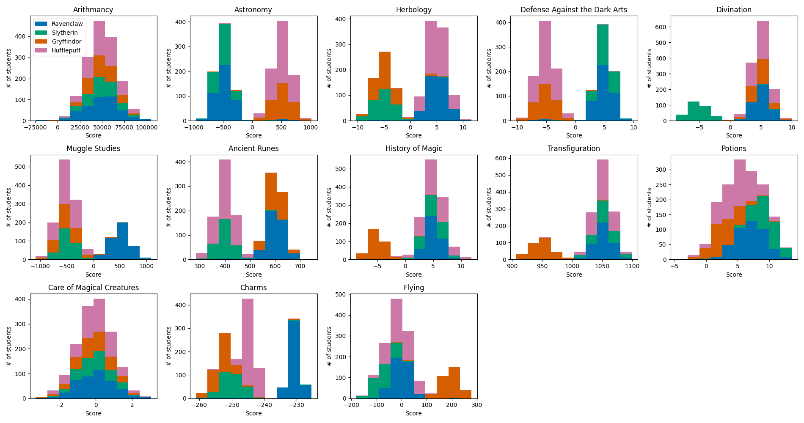
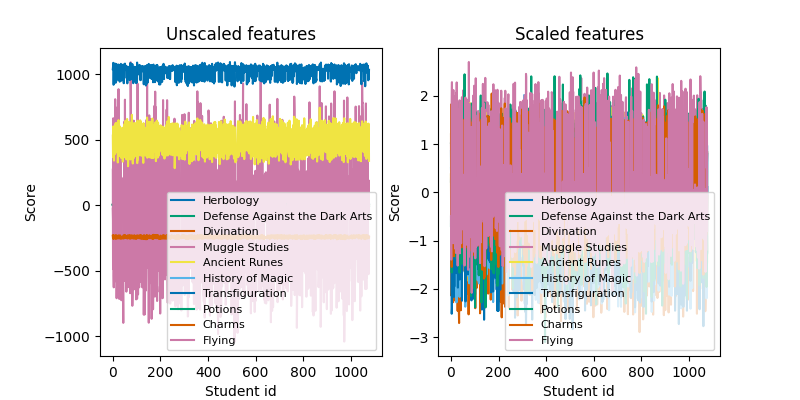
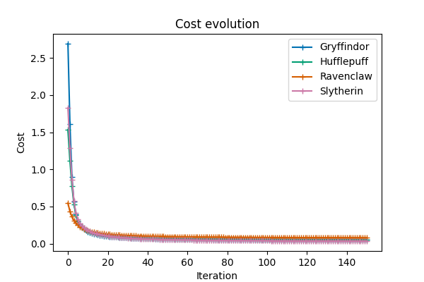

# 42 Data Science - Logistic Regression

The goal of this project is to implement a multi-class linear classifier "from scratch" using logistic regression. From scratch here means that we implement our own data statistics tools, feature scaling, cost function, and gradient descent algorithm. We use Python 3.10 and the following libraries: numpy for efficient array/matrix operations, pandas for the manipulation of the csv dataset, and matplotlib for the visualization.

## The story

The Sorting Hat of the infamous Hogwarts school of wizards is not longer working and cannot fulfill his role of sorting the students into the four houses: _Ravenclaw_, _Gryffindor_, _Slytherin_, and _Hufflepuff_. We are provided a dataset from the previous years containing the scores of 1600 students across 13 fields, and the houses they were assigned to. With our muggle datascience and machine learning tools, we need to simulate a Sorting Hat to be able to sort the 400 new students into their best fitting houses based on their scores.

## Data Analysis

We create a program for computing basic statistics of our training dataset. For each of the 13 courses/fields, we compute the number of data points (count), mean score, standard deviation, minimum, maximum, median, first and third quartile. Note that this program is basically a re-implementation of the pandas builtin describe() function (that we are not allowed to use).

```sh
python src/ft_describe.py datasets/dataset_train.csv
```

Output:
```
          Arithmancy    Astronomy    Herbology  Defense Against the Dark Arts  Divination  Muggle Studies  Ancient Runes  History of Magic  Transfiguration      Potions  Care of Magical Creatures       Charms       Flying
Count    1566.000000  1568.000000  1567.000000                    1569.000000  1561.00000     1565.000000    1565.000000       1557.000000      1566.000000  1570.000000                1560.000000  1600.000000  1600.000000
Mean    49634.570243    39.797131     1.141020                      -0.387863     3.15391     -224.589915     495.747970          2.963095      1030.096946     5.950373                  -0.053427  -243.374409    21.958012
Std     16674.479577   520.132330     5.218016                       5.211132     4.15397      486.189433     106.251202          4.424353        44.111025     3.146852                   0.971146     8.780895    97.601087
Min    -24370.000000  -966.740546   -10.295663                     -10.162119    -8.72700    -1086.496835     283.869609         -8.858993       906.627320    -4.697484                  -3.313676  -261.048920  -181.470000
25%     38511.500000  -489.551387    -4.308182                      -5.259095     3.09900     -577.580096     397.511047          2.218653      1026.209993     3.646785                  -0.671606  -250.652600   -41.870000
50%     49013.500000   260.289446     3.469012                      -2.589342     4.62400     -419.164294     463.918305          4.378176      1045.506996     5.874837                  -0.044811  -244.867765    -2.515000
75%     60811.250000   524.771949     5.426317                       4.904680     5.66700      254.994857     597.492230          5.825242      1058.436410     8.248173                   0.589919  -232.552305    50.560000
Max    104956.000000  1016.211940    11.612895                       9.667405    10.03200     1092.388611     745.396220         11.889713      1098.958201    13.536762                   3.056546  -225.428140   279.070000
```

We note the wide discrepancy of the score ranges used in different courses. This already gives us a hint that feature scaling will be necessary for the convergence of the gradient descent.

## Data Visualization

### Histograms of score distribution

To get a better sense of the score distribution in the different courses, and across the 4 houses, we produce a stacked histogram array. The output histogram is saved in the _figures_ directory.

```sh
python src/histogram.py
```



We observe that the course _Care of Magical Creatures_ has the most homogeneous score distribution across the 4 houses, closely followed by the _Arithmancy_ course. The scores in these two discipline likely have very little to no effect in the house attribution process.

### Pair plots

To study the possible score correlation between different courses, as well as their combined effect on house attribution, we produce scatter plots for each possible pair of course, that is 78 (13 x 12 / 2) scatter plots visualized across 4 different figures.

```sh
python src/pair_plot.py
```


We observe above the first 20 pair plots. Let's first focus on the pair plot corresponding to the two courses identified previously as having a homogeneous score distribution across the different houses: _Arithmancy_ - _Care of Magical Creatures_. The 4 clouds of points are fully superimposed and do not allow to discriminate between their corresponding 4 houses. We thus discard those two features from the dataset. We also notice that two features are perfectly (anti-)correlated and thus fully redundant: _Astronomy_ and _Defense Against the Dark Arts_. We remove the _Astronomy_ feature from our dataset.

## Logistic Regression

To implement our multi-class linear classifier, we follow the procedure and notation of the [Coursera Machine Learning](https://www.coursera.org/learn/machine-learning?specialization=machine-learning-introduction) course by Andrew Ng. Because we do not have access to the true houses corresponding to the students in the test set (only revealed during project evaluation), we need to split our training set into two subsets to validate our procedure. 80% of the students are randomly sampled from the original train dataset and placed into a new training set, and the remaining 20% into a "dummy" test set. The actual house labels are moved from the new test set into an _expected_result_ csv file. These different files are generated into the _validation_datasets_ folder with the following command:

```sh
python src/generate_validation_datasets.py
```

### Data cleaning and feature scaling


From our training set, we remove the students for which some scores are missing. We retain $n = 1061$ students of the original $1280$. Let $m = 10$ be the number of remaining features (course scores), and $x_{ij}$ the score in course $i$ of student $j$.

The range of score being widely different from one course to another, it is important for the convergence of the gradient descent that we scale our features so they have similar means and standard deviations. This normalization is performed as $x_{ij} = \frac{x_{ij} - \mathrm{mean}(x_{ij})}{\mathrm{std}(x_{ij})}$, where the mean and standard deviation are computed over the $j = 1$ to $n$ students. The orginal and scaled features are shown in the figure below:



### Prediction

For a given student $j$, a prediction consists in computing an output $\hat{y}_ j$ (in fact several) whose value corresponds to its assigned house. 
Let's first examine the form of linear regression prediction, as the logistic regression can be viewed as an extension of this approach. In linear regression, a set of $m + 1$ weights $\theta_i$ is used to construct a prediction output $\hat{y}^{\mathrm{lin}} _j$ as a linear combination of the features:
$$\hat{y}^{\mathrm{lin}} _j = \theta_0 + \theta_1 x_{1j} + \theta_2 x_{2j} + ... + \theta_m x_{mj}$$
or in the more compact matrix form: 
$$\mathbf{\hat{y}^{\mathrm{lin}}} = \mathbf{\theta^T X}$$
where the first row of $\mathbf{X}$ of size $(m + 1, n)$ is a row vector of $n$ ones $[1, 1, ..., 1]$ to allow the addition of the constant term $\theta_0$, and the rest of the matrix contains the scaled $x_{ij}$ elements. $\mathbf{\theta}$ is a column vector of the $m + 1$ weights to be learnt, and $\mathbf{\hat{y}^{\mathrm{lin}}}$ a row vector of the $n$ predictions.
The output values $\hat{y}^{\mathrm{lin}} _j$ of linear regression are unbounded. However, in logistic regression, these values should be bounded between 0 and 1 as $y_j$ is interpreted as the probability of a data point (a student) belonging to a given class (a house).
The prediction of logistic regression is therefore expressed as:
$$\mathbf{\hat{y}} = h(\mathbf{\theta^T X})$$
where $h(x) = \frac{1}{1 + e^{-x}}$ is called the logistic (or sigmoid) function, and whose output is bounded between 0 and 1.

The logistic function is appropriate to separate data into two categories, depending whether its output is closer to 0 or 1. However, in our case, the data need to be sorted into 4 different classes (houses). This multi-class classification problem can be solved using the one vs all approach, which requires as many classifiers as there are classes. Each classifier consists of a set of $m + 1$ weights $\theta_i$ for which a prediction $y_j$ is interpreted as the probability of data point (student) $j$ belonging to a certain class (house). To get our final prediction of which house a student belongs to, we select the house for which the estimated probability is the highest.

### Cost function

From our training dataset, we create four different objective row vectors $\mathbf{y}$ consisting of 1 or 0 depending on whether or not each student belongs to the corresponding house. These vectors form the "labels" of our training dataset that our supervised learning approach should try to fit.
The cost function $J(\mathbf{\theta})$ tells us, for a given set of weights $\mathbf{\theta}$, how well our estimation $\mathbf{\hat{y}}$ fits the labels $\mathbf{y}$. In linear regression, such cost function is usually the average of the squared distance between $\mathbf{\hat{y}}$ and $\mathbf{y}$. However, it can be shown that a cost function of this form is unsuited for logistic regression as it presents many local minima. Instead, a better suited cost function is computed as:
$$J(\mathbf{\theta}) = -\frac{1}{m} \sum_{j = 1}^{n} [\ y_j \mathrm{log}(\hat{y}_j)  + (1 - y_j) \mathrm{log}(1 - \hat{y}_j) ]\ $$
$$= -\frac{1}{m} [\ \mathrm{log} (\mathbf{\hat{y}}) \mathbf{y^T} + \mathrm{log} (1 - \mathbf{\hat{y}}) (1 - \mathbf{y^T}) ]\ $$
with $\mathbf{\hat{y}} = h(\mathbf{\theta^T X})$.

### Gradient descent

For each of the 4 classifiers, we are looking at computing a set of weights $\mathbf{\theta}$ that minimizes the cost function $J(\mathbf{\theta})$. $J(\mathbf{\theta})$ can be seen as a concave hyper-surface of which we aim to reach the bottom. The idea of gradient descent is to iteratively walk downhill in the direction of the steepest slope (i.e., opposite the gradient direction).

The gradient $\frac{\partial J}{\partial \theta_i}$ of the above cost function can be shown to be equal to:
$$\frac{\partial J}{\partial \theta_i} = \frac{1}{n} \sum_{j=1}^{n} (\hat{y} _j - y_j) X_{ij}$$
for $i = 0$ to $m$, or
$$\mathbf{\nabla} J(\mathbf{\theta}) = \frac{1}{n} \mathbf{X} [\ \mathbf{\hat{y}} - \mathbf{y} ]\ ^T$$
using matrix notation.
The iterative descent algorithm consists of iteratively updating $\mathbf{\theta}$:
$$\theta_i := \theta_i - \alpha \frac{\partial J}{\partial \theta_i}$$
for $i = 0$ to $m$, or
$$\mathbf{\theta} := \mathbf{\theta} -\alpha \mathbf{\nabla} J(\mathbf{\theta})$$
using matrix notation.
$\alpha$ is a parameter that controls the size of the steps. $\alpha$ should be small enough to ensure stability, i.e., to guarantee that each step we take reduces the value of the cost function. But $\alpha$ should also be large enough to ensure convergence towards the minimum in a reasonable time. In practice, we test various $\alpha$ values across several order of magnitudes and look at the evolution of the cost function $J(\mathbf{\theta})$ along iterations. For a converging gradient descent, a typical evolution of the cost function looks like the one below ($\alpha$=0.5, 150 iterations):



Note that this figure shows the convergence of the 4 gradient descents corresponding to the 4 different classifiers (4 houses) that we train. The weights $\mathbf{\theta}$ of the 4 classifiers are saved into a _npz_ binary file along with the feature scaling parameters (mean and standard deviation of course scores).

The training of the classifiers is performed with the following command:

```sh
python src/logreg_train.py --valid
```
for the training subset used for our validation procedure, or
```sh
python src/logreg_train.py
```
for the full training dataset.

### Application to the test set

To make a prediction on the test set, we first load the trained weights $\mathbf{\theta}$ of the 4 classifiers, and the feature scaling parameters. We load our test set and apply the same feature selection and scaling that we used on the train set. For each classifier, we compute the estimated probabilities of belonging to the corresponding house using the logistic regression formula $\mathbf{\hat{y}} = h(\mathbf{\theta^T X})$. We then assign each student with the house that shows the highest probability and save the results in the _houses.csv_ file.

```sh
python src/logreg_predict.py --valid
```
for the test set of the validation procedure, or
```sh
python src/logreg_predict.py
```
for the real test set.

Finally, to assess the accuracy of our procedure on the validation datasets, we compute the percentage of matching names between the predicted (_houses.csv_) and true (_expected_result.csv_) houses:

```sh
python src/assess_accuracy.py
```

Depending on the random sampling instance of the train and test validation subsets, the house attribution accuracy seem to oscillate between 97% and 99%.
