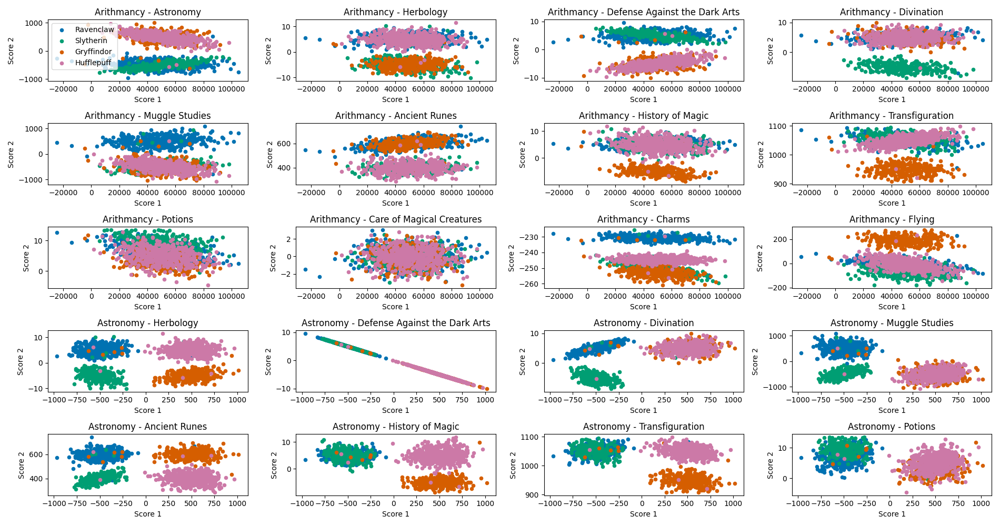

# 42 Data Science: Logistic Regression (DSLR)

The goal of this project is to implement a multi-class linear classifier "from scratch" using logistic regression. From scratch here means that we implement our own data statistics tools, feature scaling, cost function, and gradient descent algorithm. We use Python 3.10 and the following libraries: numpy for efficient array/matrix operations, pandas for the manipulation of the dataset, and matplotlib for the visualization.

## The story

The Sorting Hat of the infamous Hogwarts school of wizards is not longer working and cannot fulfill his role of sorting the students into the four houses: _Ravenclaw_, _Gryffindor_, _Slytherin_, and _Hufflepuff_. We are provided a dataset from the previous years containing the scores of 1600 students across 13 fields, and the houses they were assigned to. With our muggle datascience and machine learning tools, we need to simulate a Sorting Hat to be able to sort the 400 new students into their best fitting houses based on their scores.

## Task 1: Data Analysis

We create a program for computing basic statistics of our training dataset. For each of the 13 courses/fields, we compute the number of data points (count), mean score, standard deviation, minimum, maximum, median, first and third quartile. Note that this program is basically a reimplementation of the pandas builtin describe() function (that we are not allowed to use).

```sh
python ft_describe.py ../datasets/dataset_train.csv
```

Output:
```
          Arithmancy    Astronomy    Herbology  ...  Care of Magical Creatures       Charms       Flying
Count    1566.000000  1568.000000  1567.000000  ...                1560.000000  1600.000000  1600.000000
Mean    49634.570243    39.797131     1.141020  ...                  -0.053427  -243.374409    21.958012
Std     16674.479577   520.132330     5.218016  ...                   0.971146     8.780895    97.601087
Min    -24370.000000  -966.740546   -10.295663  ...                  -3.313676  -261.048920  -181.470000
25%     38511.500000  -489.551387    -4.308182  ...                  -0.671606  -250.652600   -41.870000
50%     49013.500000   260.289446     3.469012  ...                  -0.044811  -244.867765    -2.515000
75%     60811.250000   524.771949     5.426317  ...                   0.589919  -232.552305    50.560000
Max    104956.000000  1016.211940    11.612895  ...                   3.056546  -225.428140   279.070000
```

We note the wide discrepancy of the score ranges used in different courses. This already gives us a hint that feature scaling will be crucial for the convergence of the gradient descent.

## Task 2: Data Visualisation

### Histograms of score distribution

To get a better sense of the score distribution in the different courses, and across the 4 houses, we implement a stacked histogram array. The output histogram is saved in the _figures_ directory

```sh
Python histogram.py
```


We observe that the course _Care of Magical Creatures_ has the most homogeneous score distribution across the 4 houses, closely followed by the _Arithmancy_ course. The scores in these two discipline likely have very little to no effect in the house selection process.

### Pair plots

To study the possible score correlation between different courses, as well as their combined effect on house attribution, we produce scatter plots for each possible pair of course, that is 78 (13 x 12 / 2) scatter plots visualized across 4 different figures.

```sh
python pair_plot.py
```



We observe above the first 20 pair plots. Let's first focus on the pair plot corresponding to the two courses identified above as having a homogeneous score distribution across the different houses: _Arithmacy_ - _Care of Magical Creatures_. The 4 clouds of points are fully superimposed and do not allow to discriminate between their corresponding 4 houses. We thus discard those two features from the dataset. We also notice that two features are perfectly (anti-)correlated and thus fully redundant: _Astronomy_ and _Defense Against the Dark Arts_. We remove the _Astronomy_ feature from our dataset.

## Task 3: Logistic Regression

To implement our multi-class linear classifier, we follow the procedure and notation of the [Coursera Machine Learning](https://www.coursera.org/learn/machine-learning?specialization=machine-learning-introduction) course by Andrew Ng.

### Data cleaning and feature scaling

From our training set, we remove the students for which some scores are missing. We retain $n = 1300$ students of the original 1600. Let $m = 10$ be the number of remaining features (course scores), and $x_ij$ the score in course $i$ of student $j$.

The range of score being widely different from one course to another, it is important for the convergence of the gradient descent that we scale our features so they have similar means and standard variations. This normalization is performed as $x_{ij} = \frac{x_{ij} - \mathrm{mean}(x_{ij})}{\mathrm{std}(x_{ij})}$, where the mean and standard deviation are computed over the $j = 1$ to $n$ students. 

### Prediction

For a given student $j$, a prediction consists in computing an output $y_j$ (in fact several) whose value corresponds to its assigned house. 
Let's first examine the form of linear regression prediction, as the logistic regression can be viewed as an extension of this approach. In linear regression, a set of $m + 1$ weights $\theta_i$ is used to construct a prediction output $y_j$ as a linear combination of the features:
$$y_j = \theta_0 + \theta_1 x_{1j} + \theta_2 x_{2j} + ... + \theta_m x_{mj}$$
or in the more compact matrix form: 
$$\bm{y} = \bm{\theta^T X}$$
where the first row of $\bm{X}$ of size $(m + 1, n)$ is a row vector of $n$ ones $[1, 1, ..., 1]$ to allow the addition of the constant term $\theta_0$, and the rest of the matrix contains the scaled $x_{ij}$ elements. $\theta$ is a column vector of the $m + 1$ weights to be tuned/learned, and $\bm{y}$ a row vector of the $n$ predictions.
The output values $y_j$ of linear regression are unbounded. However, in logistic regression, these values should be bounded between 0 and 1 as $y_j$ is interpreted as the probability of a data point (a student) belonging to a given class (a house).
The prediction of logistic regression is therefore expressed as:
$$\bm{y} = h(\bm{\theta^T X})$$
where $h(x) = \frac{1}{1 + e^{-x}}$ is called the logistic (or sigmoid) function, and whose output is bounded between 0 and 1.

In the one vs all approach that we implement, we need to build 4 different classifiers, each of which will outpuyt the probability of belonging to a given house. To get our final prediction of which house a student belongs to, we select the house for which the probabiliyt estimated is the highest. From our training dataset, we create for different objective vectors y consisting of 0 or 1 depending on the appartenence or not of each students to the correspponding house. These vectors form the "labels" for our supervised learning approach.

### Cost function

The cost function tells us, for a given set of weights theta, how well our estimation yest fits the real outputs yreal. While that cost function has a simple form for linear regression (namely sum square diff), it can be shown that this form is unsuited for logistic regression convergence as it presents many local minimas. Instead, the cost function that we will use is:
J() = ...

### Gradient
and the corrsponding gradient:

The idea of gradient descent is to iteratively update our weights theta, so that we follow a path towards the minimum of the cost function J. Alpha should be small enough to ensure stability, and large enough to ensure rapidity. In practice we test various alpha across several order of maginitude and look at the corresponding evolution for the cost function along iterations. A typical converging cost function look line the ones below (alpha=0.5):

fig here


